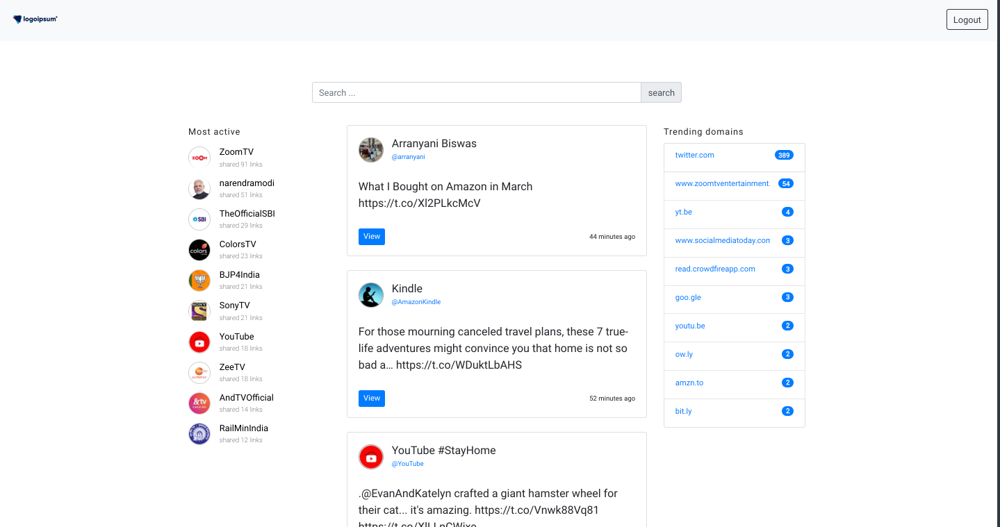

# Twitter Top links Dashboard

> Helps you to see last 7 days tweets in your timeline and also analyze it

### DEMO - https://twitter-top-links.herokuapp.com/

## Requirements

To run this application in your system you need

1. Node.js
2. Free ports 5481, 8080

## Installation

```bash
# install dependencies
npm install

# start the rect app, serve with hot reload at localhost:5481, try to run this in same port
npm run start:client

# start the server in debug mode with auto restart, please keep this port to 8080
npm run debug

# build for production and launch server
npm run build
npm run start
```

## Required settings or Variable values

Create a `.env` file in the project root with all the variable values

```bash
PORT=8080
NODE_ENV=production

CONSUMER_API_KEY=
CONSUMER_API_SECRET_KEY=
TWITTER_CALLBACK_URL=

MONGODB_USER=
MONGODB_PASSWORD=
MONGODB_URL=
```

### Dashboard


